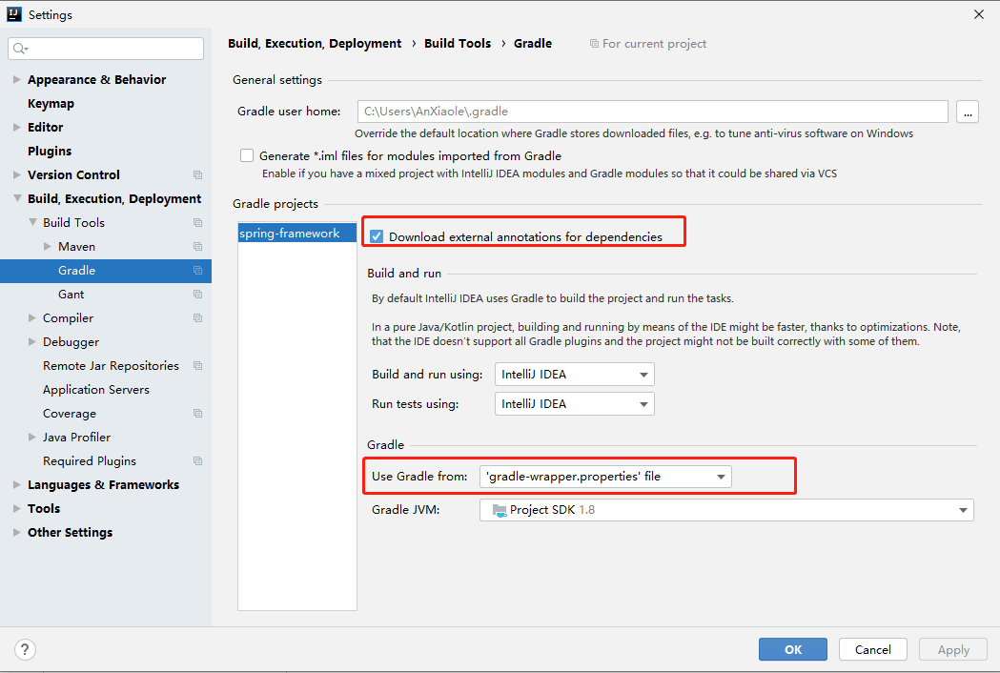
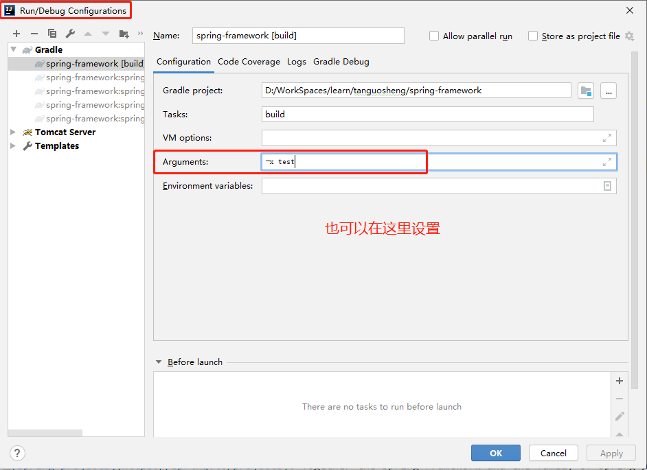
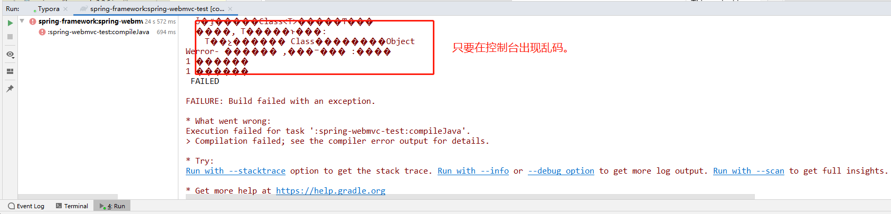

# 这里是我和小伙伴整理的spring源码注释项目
# 如有不正，欢迎交流！~
### 请积极地发邮件指正注释中的错误，不胜感激！~  guosheng.tan@foxmail.com

#  Spring Framework

# 如何导入idea：

## 下载 gradle 4.9

用以下链接下载 gradle 4.9 版本（radle-src为gralde源码，gradle-bin为安装包，gradle-all为源码加安装包）
(idea 自带的 gradle 版本可能更新（5.0）或者更老，会有各种编译问题)
https://services.gradle.org/distributions/gradle-4.9-bin.zip




## 配置环境变量：

GRADLE_HOME=/Users/***/tools/gradle-4.9
Path引入环境变量，例子如下：
PATH=$GRADLE_HOME/bin:$PATH:.

命令行 gradle -v 检测 gradle 是否安装成功。。。

idea -> Preferences | Build, Execution, Deployment | Build Tools | Gradle 配置为自己下载的gradle地址（idea）

jdk版本为1.8， 我的为1.8.0_161-b12，可以编译成功

在编译时可以使用 gradle -x test clean build 跳过测试代码运行,可以加快打包速度.



跑一下 build.gradle，等到片刻 即可... 

P.s.: 此源码编译配置和官方不完全一致，有适当的增删


# 【遇到问题及解决方案】

## 一、IDEA Gradle项目控制台输出乱码



解决方案参考：https://blog.csdn.net/xiaopihair123/article/details/105161231 （记得重启idea)


## 二、spring-aspects 模块编译的时候，找不到符号

报错信息：

```
D:\WorkSpaces\learn\tanguosheng\spring-framework\spring-aspects\src\main\java\org\springframework\cache\aspectj\AspectJCachingConfiguration.java:42:12
java: 找不到符号
  符号:   类 AnnotationCacheAspect
  位置: 类 org.springframework.cache.aspectj.AspectJCachingConfiguration
D:\WorkSpaces\learn\tanguosheng\spring-framework\spring-aspects\src\main\java\org\springframework\cache\aspectj\AspectJCachingConfiguration.java:43:9
java: 找不到符号
  符号:   类 AnnotationCacheAspect
  位置: 类 org.springframework.cache.aspectj.AspectJCachingConfiguration
D:\WorkSpaces\learn\tanguosheng\spring-framework\spring-aspects\src\main\java\org\springframework\cache\aspectj\AspectJCachingConfiguration.java:43:45
java: 找不到符号
  符号:   变量 AnnotationCacheAspect
  位置: 类 org.springframework.cache.aspectj.AspectJCachingConfiguration

```

解决方案：https://blog.csdn.net/cs373616511/article/details/107833530