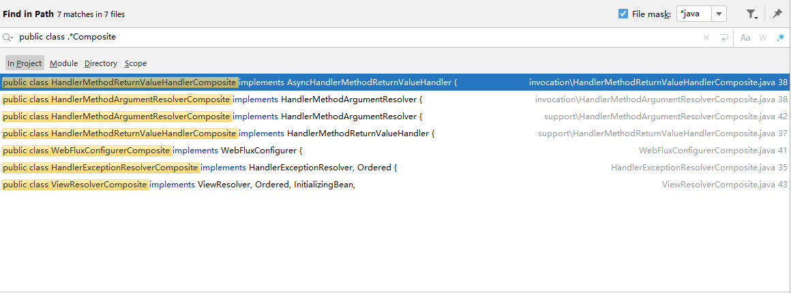

# 适配器模式（Adapter）

## 简介

https://blog.csdn.net/LoveLion/article/details/8624325

https://blog.csdn.net/LoveLion/article/details/8624412

https://blog.csdn.net/LoveLion/article/details/8624428

https://blog.csdn.net/LoveLion/article/details/8624633

## 源码

org.springframework.web.servlet.HandlerAdapter

org.springframework.web.servlet.handler.AbstractHandlerMapping#adaptInterceptor

# 策略模式（Strategy）

## 介绍

https://blog.csdn.net/LoveLion/article/details/7818983

https://blog.csdn.net/LoveLion/article/details/7819136

https://blog.csdn.net/LoveLion/article/details/7819216

https://blog.csdn.net/LoveLion/article/details/7819266

## 源码

# 组合模式（Composite）

## 介绍

https://blog.csdn.net/LoveLion/article/details/7956898

https://blog.csdn.net/LoveLion/article/details/7956908

https://blog.csdn.net/LoveLion/article/details/7956931

https://blog.csdn.net/LoveLion/article/details/7956937

https://blog.csdn.net/LoveLion/article/details/7956962

## 源码

org.springframework.web.method.support.HandlerMethodArgumentResolverComposite

org.springframework.web.method.support.HandlerMethodReturnValueHandlerComposite

org.springframework.web.servlet.handler.HandlerExceptionResolverComposite

org.springframework.web.servlet.view.ViewResolverComposite

org.springframework.web.reactive.config.WebFluxConfigurerComposite

org.springframework.messaging.handler.invocation.HandlerMethodArgumentResolverComposite

org.springframework.messaging.handler.invocation.HandlerMethodReturnValueHandlerComposite

